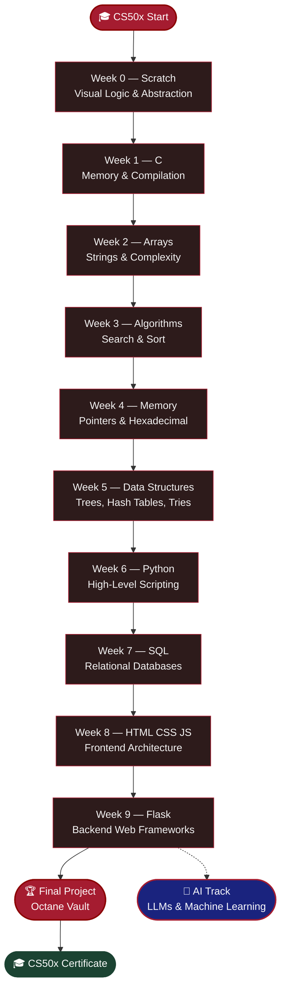
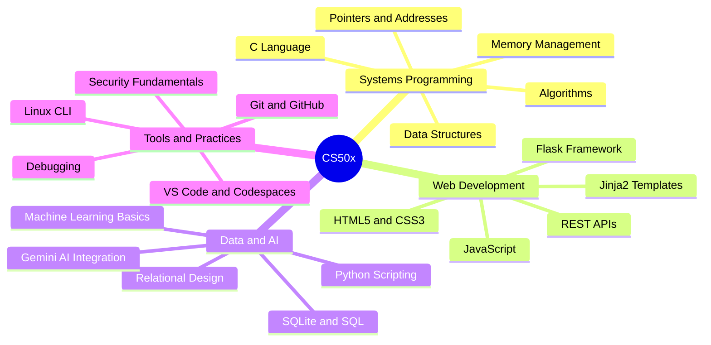

<a id="top"></a>

<div align="center">
  <br />
  
  <br /><br />
  <a href="https://git.io/typing-svg"></a>
  <br />
  <a href="https://git.io/typing-svg"></a>
  <br /><br />

  
  
  
  
  <br /><br />
  
  
  
  
  
</div>

<br />

> **A complete, polished archive of every problem set, lab, and the final project from [Harvard's CS50x](https://cs50.harvard.edu/x) — spanning C, Python, SQL, HTML/CSS/JS, Flask, and AI.** This repository documents the full journey from `printf("hello, world")` to a production-grade, AI-powered web application.

---

## 🧭 Navigation

<div align="center">

| | Section | | Section |
|:---:|:---|:---:|:---|
| 🗺️ | [Curriculum Roadmap](#-curriculum-roadmap) | 📂 | [Weekly Breakdown](#-weekly-breakdown) |
| 💡 | [Learning Moments](#-highlighted-learning-moments) | 🏎️ | [Final Project](#%EF%B8%8F-final-project-octane-vault) |
| 🪐 | [What You Can Learn](#-what-you-can-learn-from-cs50x) | 📖 | [Study Guide & Resources](#-study-guide--resources) |
| 🎓 | [Certificate](#-certificate--verification) | ⚖️ | [License](#%EF%B8%8F-license--academic-honesty) |
| 💬 | [Get in Touch](#-get-in-touch) | 📊 | [Repository Analytics](#-repository-analytics) |

</div>

---

## 🗺️ Curriculum Roadmap

<div align="center">

| Week | Topic & Focus | Language | 📁 Folder |
|:---:|:---|:---|:---|
| **`00`** | Visual Logic & Abstraction | Scratch | [**Open ↗**](https://github.com/bavish007/cs50x/tree/main/Week%200%20Scratch) |
| **`01`** | Memory & Compilation | C | [**Open ↗**](https://github.com/bavish007/cs50x/tree/main/Week%201%20C) |
| **`02`** | Arrays, Strings & Complexity | C | [**Open ↗**](https://github.com/bavish007/cs50x/tree/main/Week%202%20Arrays) |
| **`03`** | Search & Sort Algorithms | C | [**Open ↗**](https://github.com/bavish007/cs50x/tree/main/Week%203%20Algorithms) |
| **`04`** | Pointers, Memory & Hexadecimal | C | [**Open ↗**](https://github.com/bavish007/cs50x/tree/main/Week%204%20Memory) |
| **`05`** | Trees, Hash Tables & Tries | C | [**Open ↗**](https://github.com/bavish007/cs50x/tree/main/Week%205%20Data%20Structures) |
| **`06`** | High-Level Scripting | Python | [**Open ↗**](https://github.com/bavish007/cs50x/tree/main/Week%206%20Python) |
| **`07`** | Relational Databases | SQL / SQLite | [**Open ↗**](https://github.com/bavish007/cs50x/tree/main/Week%207%20SQL) |
| **`08`** | Frontend Architecture | HTML · CSS · JS | [**Open ↗**](https://github.com/bavish007/cs50x/tree/main/Week%208%20HTML%2C%20CSS%2C%20JavaScript) |
| **`09`** | Backend Web Frameworks | Flask · Python | [**Open ↗**](https://github.com/bavish007/cs50x/tree/main/Week%209%20Flask) |
| **`🏆 FINAL`** | Full-Stack Capstone — Octane Vault | Full Stack | [**Open ↗**](https://github.com/bavish007/cs50x/tree/main/Week%2010%20The%20End/Final%20Project/Octane_Vault) |
| **`🤖 AI`** | LLMs & Machine Learning | Python · AI | [**Open ↗**](https://github.com/bavish007/cs50x/tree/main/Artificial%20Intelligence) |

</div>

---



---

## 📂 Weekly Breakdown

| Module | Intellectual Focus | Key Concepts | Tech Stack | Repository |
| :---: | :--- | :--- | :--- | :---: |
| **`WEEK 00`** | Visual Logic & Abstraction | Events, loops, conditionals, sprites |  | [🔗 Open](./Week%200%20Scratch) |
| **`WEEK 01`** | Memory & Compilation | Types, operators, `printf`, conditionals |  | [🔗 Open](./Week%201%20C) |
| **`WEEK 02`** | Arrays, Strings & Complexity | `argc`/`argv`, arrays, cryptography |  | [🔗 Open](./Week%202%20Arrays) |
| **`WEEK 03`** | Search & Sort Algorithms | Binary search, merge sort, Big-O |  | [🔗 Open](./Week%203%20Algorithms) |
| **`WEEK 04`** | Pointers & Hexadecimal | `malloc`, `free`, file I/O, forensics |  | [🔗 Open](./Week%204%20Memory) |
| **`WEEK 05`** | Trees, Hash Tables, Tries | Linked lists, hash functions, tries |  | [🔗 Open](./Week%205%20Data%20Structures) |
| **`WEEK 06`** | High-Level Scripting | Python syntax, list comprehensions, libraries |  | [🔗 Open](./Week%206%20Python) |
| **`WEEK 07`** | Relational Databases | `SELECT`, `JOIN`, SQL injection, schema design |  | [🔗 Open](./Week%207%20SQL) |
| **`WEEK 08`** | Frontend Architecture | DOM manipulation, event listeners, responsive design |  | [🔗 Open](./Week%208%20HTML%2C%20CSS%2C%20JavaScript) |
| **`WEEK 09`** | Backend Web Frameworks | Routes, sessions, Jinja2, Flask |  | [🔗 Open](./Week%209%20Flask) |
| **`FINAL`** | Full-Stack Capstone | AI integration, auth, Glassmorphism UI |  | [🔗 Open](./Week%2010%20The%20End/Final%20Project/Octane_Vault) |
| **`AI`** | LLMs & Machine Learning | Prompting, embeddings, AI pipelines |  | [🔗 Open](./Artificial%20Intelligence) |

---

## 💡 Highlighted Learning Moments

<details>
<summary><b>🔴 Week 1–2 · C & Arrays — The Foundation</b></summary>
<br />

Diving into C stripped away every abstraction. Manual memory allocation, pointer arithmetic, and segmentation faults taught discipline that no high-level language can replicate. Understanding the call stack and heap at a byte level fundamentally changed how I reason about every program I write.

**Key insight:** Every string is just a `char*` — a pointer to the first byte. Once that clicks, C stops being scary and starts being powerful.

</details>

<details>
<summary><b>🔴 Week 3–5 · Algorithms & Data Structures — The Engine</b></summary>
<br />

Implementing merge sort, binary search trees, hash tables, and tries from scratch demystified the "magic" inside standard libraries. The O(n log n) vs O(n²) trade-offs became viscerally real when running performance benchmarks on large datasets.

**Key insight:** Hash collisions are inevitable — the art is in choosing the right hash function and collision strategy for your data distribution.

</details>

<details>
<summary><b>🔴 Week 6–7 · Python & SQL — The Productivity Leap</b></summary>
<br />

After weeks in C, Python felt like a superpower. Translating C problem sets to Python showed how language choice shapes developer velocity. SQL joins and subqueries unlocked relational data modeling — a paradigm shift from procedural thinking.

**Key insight:** Python's `dict` is a hash table under the hood — Week 5's struggles paid off as instant intuition here.

</details>

<details>
<summary><b>🔴 Week 8–9 · Web & Flask — The Full Picture</b></summary>
<br />

Building end-to-end web apps with Flask, Jinja2, and SQLite connected every prior concept. Sessions, cookies, CSRF tokens, and the request/response lifecycle revealed the complexity hidden behind every browser interaction.

**Key insight:** Always validate server-side. Client-side validation is a UX feature, not a security boundary.

</details>

---

## 🏎️ Final Project: Octane Vault

<div align="center">
  
  <br /><br />
  <a href="https://git.io/typing-svg"></a>
</div>

<br />

**Octane Vault** is a high-performance automotive asset management platform — a "Garage Operating System" engineered for collectors and enthusiasts. It unifies vehicle inventory, service records, financial analytics, and AI-powered data synthesis into a single, immersive web application.

### ✨ Core Features

| Feature | Description |
| :--- | :--- |
| 🤖 **AI Auto-Fill** | Enter a car model → Gemini AI synthesizes engine specs, performance data, and pricing |
| 🖼️ **Auto Imagery** | Wikipedia API fetches high-resolution vehicle images automatically |
| 📊 **Portfolio Analytics** | Real-time equity calculations, total investment tracking, depreciation analysis |
| 🏁 **Vehicle Comparison** | Side-by-side spec comparison engine for any cars in your garage |
| 🛡️ **Secure Auth** | Flask-Session + bcrypt password hashing with server-side validation |
| 🎨 **Glassmorphism UI** | Cyberpunk-inspired design with `backdrop-filter: blur()` and GPU-accelerated CSS animations |
| 🏆 **Dynamic Ranks** | Rookie → VIP → Magnate — rank progression based on garage valuation |

### 🏗️ Architecture

```
┌──────────────────────────────────────────────────────────────┐
│                      OCTANE VAULT STACK                       │
├─────────────────────┬────────────────────────────────────────┤
│  Frontend           │  HTML5 · CSS3 · Bootstrap 5 · JS       │
│  Backend            │  Python 3 · Flask · Jinja2              │
│  Database           │  SQLite3 (cs50 library)                 │
│  AI Engine          │  Google Gemini API                      │
│  Image Source       │  Wikipedia API                          │
│  Auth               │  Flask-Session · bcrypt                 │
│  Deployment         │  Local / CS50 Codespace                 │
└─────────────────────┴────────────────────────────────────────┘
```

### 📂 Project Structure

```text
Octane_Vault/
├── app.py                 # Core routing & session logic
├── helpers.py             # Gemini AI & API pipeline + smart fallbacks
├── garage.db              # Normalized SQLite relational database
├── requirements.txt       # Python dependencies
├── static/
│   └── styles.css         # Glassmorphism UI · keyframes · animations
└── templates/
    ├── layout.html        # Jinja2 master template
    ├── index.html         # Dashboard with 3D tilt cards
    ├── add.html           # AI auto-fill vehicle forms
    ├── compare.html       # Dynamic spec comparison engine
    └── profile.html       # Aggregate equity statistics
```

📁 [**View Full Project →**](./Week%2010%20The%20End/Final%20Project/Octane_Vault)

---

## 🪐 What You Can Learn from CS50x

> *This repository is a reference for anyone who wants to self-study CS50x — one of the world's most respected free computer science courses. You don't need to pay for a certificate to gain the knowledge.*

### Skills Covered in This Course



<div align="center">


</div>

---

## 📖 Study Guide & Resources

<details>
<summary><b>📚 Official CS50 Resources</b></summary>
<br />

| Resource | Link |
| :--- | :--- |
| CS50x Course Page | [cs50.harvard.edu/x](https://cs50.harvard.edu/x) |
| CS50 Manual Pages | [manual.cs50.io](https://manual.cs50.io) |
| CS50 Duck Debugger | [cs50.ai](https://cs50.ai) |
| CS50 Codespace | [code.cs50.io](https://code.cs50.io) |
| edX Certificate | [edx.org/cs50x](https://www.edx.org/course/introduction-computer-science-harvardx-cs50x) |

</details>

<details>
<summary><b>🔧 Recommended Supplementary Tools</b></summary>
<br />

| Tool | Purpose |
| :--- | :--- |
| **Valgrind** | Memory leak detection in C |
| **GDB** | GNU Debugger for C programs |
| **SQLite Browser** | Visual DB editor |
| **Postman** | API testing for Flask routes |
| **Python Tutor** | Visual code execution tracer |

</details>

<details>
<summary><b>📝 Week-by-Week Key Takeaways</b></summary>
<br />

| Week | Core Takeaway |
| :---: | :--- |
| **0** | Computational thinking: decomposition, pattern recognition, abstraction, algorithms |
| **1** | The C compiler pipeline: preprocessing → compiling → assembling → linking |
| **2** | Stack frames, string as `char*`, command-line arguments `argc`/`argv` |
| **3** | Big-O notation is a *ceiling*, not a guarantee — always benchmark real data |
| **4** | `malloc`/`free` symmetry; Valgrind is your best friend |
| **5** | Hash collisions are inevitable; choose your hash function wisely |
| **6** | Python's `dict` is a hash table; Python lists are dynamic arrays |
| **7** | `JOIN` is set intersection; `NULL` propagates through expressions |
| **8** | The DOM is a tree; event delegation > individual listeners |
| **9** | Sessions are server-side cookies; always validate server-side |

</details>

---

## 📊 Repository Analytics

<div align="center">

[](https://github.com/bavish007)

</div>

<div align="center">

[](https://github.com/bavish007)

</div>

<div align="center">

[](https://github.com/bavish007)

</div>

<div align="center">


</div>

<div align="center">

[](https://github.com/bavish007)

</div>

---

## 🎓 Certificate & Verification

<div align="center">

| Detail | Value |
| :--- | :--- |
| **Institution** | Harvard University (via edX) |
| **Course** | CS50's Introduction to Computer Science |
| **Track** | CS50x |
| **Certificate** | [📄 View Certificate PDF](https://certificates.cs50.io/281e3ed5-304f-4016-8bc0-e1c511825376.pdf?size=letter) |

[](https://certificates.cs50.io/281e3ed5-304f-4016-8bc0-e1c511825376.pdf?size=letter)

</div>

---

## ⚖️ License & Academic Honesty

<div align="center">

[](./LICENSE)

</div>

This repository is licensed under the [MIT License](./LICENSE).

> ⚠️ **Academic Honesty Notice:** This repository is shared for **portfolio and reference purposes only**. All code here represents my own original work completed as part of CS50x. Per [CS50's Academic Honesty Policy](https://cs50.harvard.edu/x/honesty), you must not submit any of this work as your own. *Be reasonable.*

---

## 💬 Get in Touch

<div align="center">

[](https://github.com/bavish007)
[](https://linkedin.com/in/bavish007)

</div>

---

<div align="center">

⭐ **Star** this repo if CS50x changed how you think about computers · 🍴 **Fork** to track your own journey · 👁️ **Watch** for updates

<br />

<a href="https://git.io/typing-svg"></a>

<br />

*Made with ❤️ and countless hours of debugging · Harvard University · CS50x*

<br />

[⬆️ Back to Top](#top)

</div>
