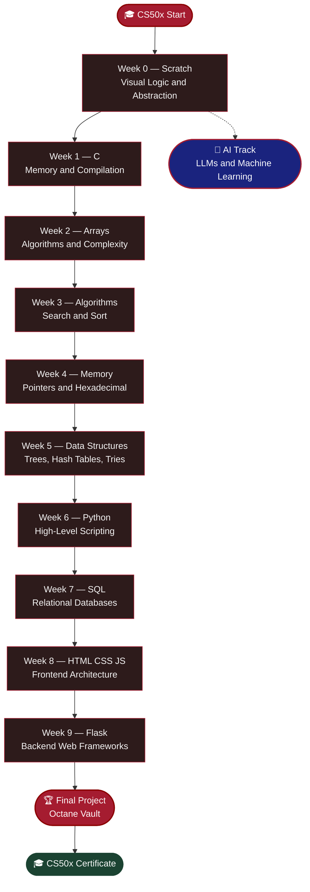
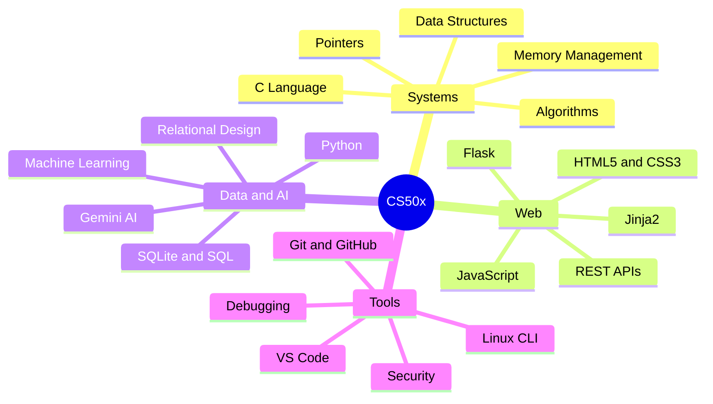

<a id="top"></a>

<div align="center">
  <br />
  
  <br /><br />
  <a href="https://git.io/typing-svg"></a>
  <br />
  <a href="https://git.io/typing-svg"></a>
  <br /><br />

  
  
  
  
</div>

<br />

---

## 🧭 Navigation

<div align="center">

| | Section | | Section |
|:---:|:---|:---:|:---|
| 🗺️ | [Curriculum Roadmap](#️-curriculum-roadmap) | 📂 | [Weekly Breakdown](#-weekly-breakdown) |
| 💡 | [Learning Moments](#-highlighted-learning-moments) | 🏎️ | [Final Project](#️-final-project-octane-vault) |
| 🧠 | [What You Can Learn](#-what-you-can-learn-from-cs50x) | 📖 | [Study Guide & Resources](#-study-guide--resources) |
| 🎓 | [Certificate](#-certificate--verification) | ⚖️ | [License](#️-license--academic-honesty) |
| 💬 | [Get in Touch](#-get-in-touch) | | |

</div>

---

## 🗺️ Curriculum Roadmap

<div align="center">

| Week | Topic & Focus | Language | 📁 Folder |
|:---:|:---|:---:|:---:|
| **`00`** | Visual Logic & Abstraction | Scratch | [**Open →**](https://github.com/bavish007/cs50x/tree/main/Week%200%20Scratch) |
| **`01`** | Memory & Compilation | C | [**Open →**](https://github.com/bavish007/cs50x/tree/main/Week%201%20C) |
| **`02`** | Algorithms & Complexity | C / Arrays | [**Open →**](https://github.com/bavish007/cs50x/tree/main/Week%202%20Arrays) |
| **`03`** | Search & Sort | C / Algorithms | [**Open →**](https://github.com/bavish007/cs50x/tree/main/Week%203%20Algorithms) |
| **`04`** | Pointers & Hexadecimal | C / Memory | [**Open →**](https://github.com/bavish007/cs50x/tree/main/Week%204%20Memory) |
| **`05`** | Trees, Hash Tables, Tries | C / Data Structures | [**Open →**](https://github.com/bavish007/cs50x/tree/main/Week%205%20Data%20Structures) |
| **`06`** | High-Level Scripting | Python | [**Open →**](https://github.com/bavish007/cs50x/tree/main/Week%206%20Python) |
| **`07`** | Relational Databases | SQL / SQLite | [**Open →**](https://github.com/bavish007/cs50x/tree/main/Week%207%20SQL) |
| **`08`** | Frontend Architecture | HTML · CSS · JS | [**Open →**](https://github.com/bavish007/cs50x/tree/main/Week%208%20HTML%2C%20CSS%2C%20JavaScript) |
| **`09`** | Backend Web Frameworks | Flask · Python | [**Open →**](https://github.com/bavish007/cs50x/tree/main/Week%209%20Flask) |
| **`🏆 FINAL`** | Full-Stack Capstone — Octane Vault | Full Stack | [**Open →**](https://github.com/bavish007/cs50x/tree/main/Week%2010%20The%20End/Final%20Project/Octane_Vault) |
| **`🤖 AI`** | LLMs & Machine Learning | Python · AI | [**Open →**](https://github.com/bavish007/cs50x/tree/main/Artificial%20Intelligence) |

</div>



---

## 📂 Weekly Breakdown

| Module | Intellectual Focus | Tech Stack | Repository |
| :---: | :--- | :--- | :---: |
| **`WEEK 00`** | Visual Logic & Abstraction |  | [🔗 Open](./Week%200%20Scratch) |
| **`WEEK 01`** | Memory & Compilation |  | [🔗 Open](./Week%201%20C) |
| **`WEEK 02`** | Data & Complexity |  | [🔗 Open](./Week%202%20Arrays) |
| **`WEEK 03`** | Search & Sort Mechanisms |  | [🔗 Open](./Week%203%20Algorithms) |
| **`WEEK 04`** | Pointers & Hexadecimal |  | [🔗 Open](./Week%204%20Memory) |
| **`WEEK 05`** | Trees, Hash Tables, Tries |  | [🔗 Open](./Week%205%20Data%20Structures) |
| **`WEEK 06`** | High-Level Scripting |  | [🔗 Open](./Week%206%20Python) |
| **`WEEK 07`** | Relational Databases |  | [🔗 Open](./Week%207%20SQL) |
| **`WEEK 08`** | Frontend Architecture |  | [🔗 Open](./Week%208%20HTML,%20CSS,%20JavaScript) |
| **`WEEK 09`** | Backend Web Frameworks |  | [🔗 Open](./Week%209%20Flask) |
| **`FINAL`** | Full-Stack Capstone |  | [🔗 Open](./Week%2010%20The%20End/Final%20Project/Octane_Vault) |
| **`AI`** | LLMs & Machine Learning |  | [🔗 Open](./Artificial%20Intelligence) |

---

## 💡 Highlighted Learning Moments

<details>
<summary><b>🔴 Week 1–2 · C & Arrays — The Foundation</b></summary>
<br />

Diving into C stripped away every abstraction. Manual memory allocation, pointer arithmetic, and segmentation faults taught discipline that no high-level language can replicate. Understanding the call stack and heap at a byte level fundamentally changed how I reason about every program I write.

</details>

<details>
<summary><b>🔴 Week 3–5 · Algorithms & Data Structures — The Engine</b></summary>
<br />

Implementing merge sort, binary search trees, hash tables, and tries from scratch demystified the "magic" inside standard libraries. The O(n log n) vs O(n²) trade-offs became viscerally real when running performance benchmarks on large datasets.

</details>

<details>
<summary><b>🔴 Week 6–7 · Python & SQL — The Productivity Leap</b></summary>
<br />

After weeks in C, Python felt like a superpower. Translating C problem sets to Python showed how language choice shapes developer velocity. SQL joins and subqueries unlocked relational data modeling — a paradigm shift from procedural thinking.

</details>

<details>
<summary><b>🔴 Week 8–9 · Web & Flask — The Full Picture</b></summary>
<br />

Building end-to-end web apps with Flask, Jinja2, and SQLite connected every prior concept. Sessions, cookies, CSRF tokens, and the request/response lifecycle revealed the complexity hidden behind every browser interaction.

</details>

---

## 🏎️ Final Project: Octane Vault

<div align="center">
  
  <br /><br />
  <a href="https://git.io/typing-svg"></a>
</div>

<br />

**Octane Vault** is a high-performance automotive asset management platform — a "Garage Operating System" engineered for collectors and enthusiasts. It unifies vehicle inventory, service records, financial analytics, and AI-powered data synthesis into a single, immersive web application.

### Architecture

```
┌─────────────────────────────────────────────────────────┐
│                   OCTANE VAULT STACK                    │
├────────────────────┬────────────────────────────────────┤
│  Frontend          │  HTML5, CSS3, Bootstrap, JS         │
│  Backend           │  Python 3, Flask, Jinja2            │
│  Database          │  SQLite3 (cs50 library)             │
│  AI Engine         │  Google Gemini API                  │
│  Image Source      │  Wikipedia API                      │
│  Auth              │  Flask-Session, bcrypt              │
│  Deployment        │  Local / CS50 Codespace             │
└────────────────────┴────────────────────────────────────┘
```

📁 [**View Full Project →**](./Week%2010%20The%20End/Final%20Project/Octane_Vault)

---

## 🧠 What You Can Learn from CS50x

<div align="center">

<a href="https://git.io/typing-svg"></a>

</div>

<br />

> *This repository is a free learning companion for anyone following CS50x — Harvard's world-class, open-enrollment computer science course.*

<br />



<br />

<div align="center">

| 🖥️ Systems Programming | 🌐 Web Development | 🗄️ Data & AI | 🛠️ Tools & Practices |
|:---|:---|:---|:---|
| C Language | HTML5 & CSS3 | SQLite / SQL | Git & GitHub |
| Memory Management | JavaScript | Relational Design | Linux CLI |
| Pointers & Addresses | Flask Framework | Python Scripting | VS Code / Codespaces |
| Data Structures | Jinja2 Templates | Gemini AI Integration | Debugging |
| Algorithms | REST APIs | Machine Learning Basics | Security Fundamentals |

</div>

<br />

<div align="center">


</div>

---

## 📖 Study Guide & Resources

<div align="center">

<a href="https://git.io/typing-svg"></a>

</div>

<br />

<details>
<summary><b>📚 Official CS50 Resources</b></summary>
<br />

| Resource | Link |
| :--- | :--- |
| CS50x Course Page | [cs50.harvard.edu/x](https://cs50.harvard.edu/x) |
| CS50 Manual Pages | [manual.cs50.io](https://manual.cs50.io) |
| CS50 Duck Debugger | [cs50.ai](https://cs50.ai) |
| CS50 Codespace | [code.cs50.io](https://code.cs50.io) |
| edX Certificate | [edx.org/cs50x](https://www.edx.org/course/introduction-computer-science-harvardx-cs50x) |

</details>

<details>
<summary><b>🔧 Recommended Supplementary Tools</b></summary>
<br />

| Tool | Purpose |
| :--- | :--- |
| **Valgrind** | Memory leak detection in C |
| **GDB** | GNU Debugger for C programs |
| **SQLite Browser** | Visual DB editor |
| **Postman** | API testing for Flask routes |
| **Python Tutor** | Visual code execution tracer |

</details>

<details>
<summary><b>📝 Week-by-Week Key Takeaways</b></summary>
<br />

- **Week 0** — Computational thinking: decomposition, pattern recognition, abstraction, algorithms
- **Week 1** — The C compiler pipeline: preprocessing → compiling → assembling → linking
- **Week 2** — Stack frames, string as `char*`, command-line arguments `argc`/`argv`
- **Week 3** — Big-O notation is a *ceiling*, not a guarantee
- **Week 4** — `malloc`/`free` symmetry; valgrind is your best friend
- **Week 5** — Hash collisions are inevitable; choose your hash function wisely
- **Week 6** — Python's `dict` is a hash table; Python lists are dynamic arrays
- **Week 7** — `JOIN` is set intersection; `NULL` propagates through expressions
- **Week 8** — The DOM is a tree; event delegation > individual listeners
- **Week 9** — Sessions are server-side cookies; always validate server-side

</details>

---

## 📊 Repository Analytics

<div align="center">

<a href="https://git.io/typing-svg"></a>

<br /><br />

<table>
<tr>
<td>

[](https://github.com/bavish007)

</td>
<td>

[](https://github.com/bavish007)

</td>
</tr>
</table>

<br />

[](https://github.com/bavish007)

<br />

</div>

---

## 🎓 Certificate & Verification

<div align="center">

<a href="https://git.io/typing-svg"></a>

<br /><br />
<table>
<tr>
<td align="center" width="500">

| Detail | Value |
| :--- | :--- |
| **Institution** | Harvard University (via edX) |
| **Course** | CS50's Introduction to Computer Science |
| **Track** | CS50x |
| **Issued** | 2025 |
| **Certificate** | [📄 View Verified PDF](https://certificates.cs50.io/281e3ed5-304f-4016-8bc0-e1c511825376.pdf?size=letter) |

</td>
</tr>
</table>

<br />

[](https://certificates.cs50.io/281e3ed5-304f-4016-8bc0-e1c511825376.pdf?size=letter)
[](https://cs50.harvard.edu/x)
[](https://certificates.cs50.io/281e3ed5-304f-4016-8bc0-e1c511825376.pdf?size=letter)

</div>

---

## ⚖️ License & Academic Honesty

<div align="center">

[](./LICENSE)

</div>

<br />
This repository is licensed under the [MIT License](./LICENSE).

> ⚠️ **Academic Honesty Notice:** This repository is shared for **learning reference purposes only**. All code here represents original work completed as part of CS50x. Per [CS50's Academic Honesty Policy](https://cs50.harvard.edu/x/honesty), you must not submit any of this work as your own. *Be reasonable.*

---

## 💬 Get in Touch

<div align="center">

<a href="https://git.io/typing-svg"></a>

<br /><br />
[](https://github.com/bavish007)
[](https://www.linkedin.com/in/bavishreddymuske)

</div>

---

<div align="center">


⭐ **Star** this repo if CS50x changed how you think about computers &nbsp;·&nbsp; 🍴 **Fork** to track your own journey &nbsp;·&nbsp; 👁️ **Watch** for updates

<br />
<a href="https://git.io/typing-svg"></a>

<br />
*Made with ❤️ and countless hours of debugging &nbsp;·&nbsp; Harvard University &nbsp;·&nbsp; CS50x*

<br />
[](#top)
