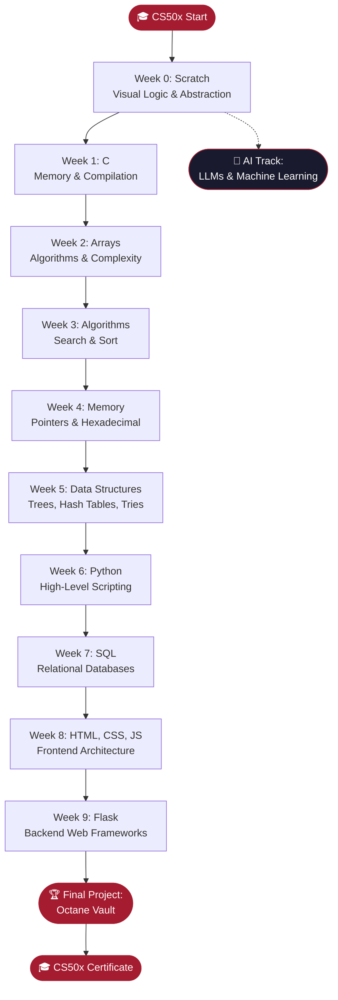
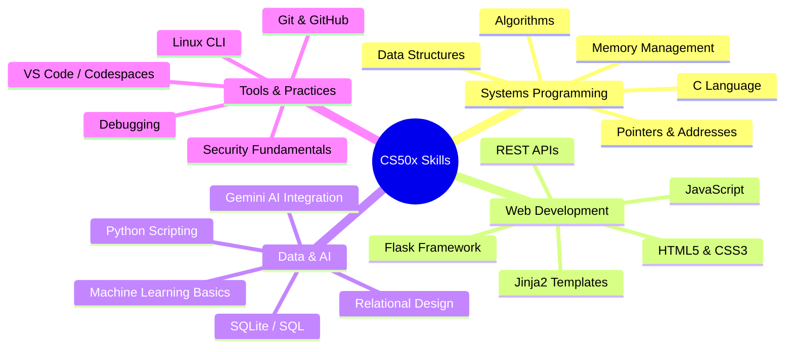

<a id="top"></a>

<div align="center">
  <br />
  
  <br /><br />
  <a href="https://git.io/typing-svg"></a>
  <br />
  <p><i>An introduction to the intellectual enterprises of computer science and the art of programming.</i></p>
  <br />

  
  
  
  
  <br /><br />
  
  
  
</div>

<br />

---

## 🧭 Navigation

[About](#-about-this-journey) · [Roadmap](#-curriculum-roadmap) · [Weekly Breakdown](#-weekly-breakdown) · [Learning Moments](#-highlighted-learning-moments) · [Final Project](#-final-project-octane-vault) · [Skills](#-skills-acquired) · [Showcase](#-project-showcase) · [Resources](#-study-guide--resources) · [Analytics](#-repository-analytics) · [Certificate](#-certificate--verification) · [Acknowledgments](#-acknowledgments) · [License](#-license--academic-honesty) · [Contact](#-get-in-touch)

---

## 🎓 About This Journey

> *CS50x is Harvard University's introduction to the intellectual enterprises of computer science and the art of programming — one of the most transformative educational experiences available online.*

```
┌─────────────────────────────────────────────────────────────────┐
│                    CS50x COMPLETION STATS                       │
├─────────────────────────────────────────────────────────────────┤
│  📚 Problem Sets Completed  :  10 / 10                          │
│  🧪 Labs Completed          :  10 / 10                          │
│  💡 Concepts Mastered       :  50+                              │
│  🌐 Languages Learned       :  Scratch, C, Python, SQL, JS, TS  │
│  🏗️  Final Project          :  Octane Vault (Full-Stack)         │
│  🤖 Bonus Track             :  Artificial Intelligence          │
│  ⭐ Certificate Status      :  Verified                         │
└─────────────────────────────────────────────────────────────────┘
```

---

## 🗺️ Curriculum Roadmap



---

## 📂 Weekly Breakdown

| Module | Intellectual Focus | Tech Stack | Repository |
| :---: | :--- | :--- | :---: |
| **`WEEK 00`** | Visual Logic & Abstraction |  | [🔗 Open](./Week%200%20Scratch) |
| **`WEEK 01`** | Memory & Compilation |  | [🔗 Open](./Week%201%20C) |
| **`WEEK 02`** | Data & Complexity |  | [🔗 Open](./Week%202%20Arrays) |
| **`WEEK 03`** | Search & Sort Mechanisms |  | [🔗 Open](./Week%203%20Algorithms) |
| **`WEEK 04`** | Pointers & Hexadecimal |  | [🔗 Open](./Week%204%20Memory) |
| **`WEEK 05`** | Trees, Hash Tables, Tries |  | [🔗 Open](./Week%205%20Data%20Structures) |
| **`WEEK 06`** | High-Level Scripting |  | [🔗 Open](./Week%206%20Python) |
| **`WEEK 07`** | Relational Databases |  | [🔗 Open](./Week%207%20SQL) |
| **`WEEK 08`** | Frontend Architecture |  | [🔗 Open](./Week%208%20HTML,%20CSS,%20JavaScript) |
| **`WEEK 09`** | Backend Web Frameworks |  | [🔗 Open](./Week%209%20Flask) |
| **`FINAL`** | Full-Stack Capstone |  | [🔗 Open](./Week%2010%20The%20End/Final%20Project/Octane_Vault) |
| **`AI`** | LLMs & Machine Learning |  | [🔗 Open](./Artificial%20Intelligence) |

---

## 💡 Highlighted Learning Moments

<details>
<summary><b>🔴 Week 1–2 · C & Arrays — The Foundation</b></summary>
<br />

Diving into C stripped away every abstraction. Manual memory allocation, pointer arithmetic, and segmentation faults taught discipline that no high-level language can replicate. Understanding the call stack and heap at a byte level fundamentally changed how I reason about every program I write.

</details>

<details>
<summary><b>🔴 Week 3–5 · Algorithms & Data Structures — The Engine</b></summary>
<br />

Implementing merge sort, binary search trees, hash tables, and tries from scratch demystified the "magic" inside standard libraries. The O(n log n) vs O(n²) trade-offs became viscerally real when running performance benchmarks on large datasets.

</details>

<details>
<summary><b>🔴 Week 6–7 · Python & SQL — The Productivity Leap</b></summary>
<br />

After weeks in C, Python felt like a superpower. Translating C problem sets to Python showed how language choice shapes developer velocity. SQL joins and subqueries unlocked relational data modeling — a paradigm shift from procedural thinking.

</details>

<details>
<summary><b>🔴 Week 8–9 · Web & Flask — The Full Picture</b></summary>
<br />

Building end-to-end web apps with Flask, Jinja2, and SQLite connected every prior concept. Sessions, cookies, CSRF tokens, and the request/response lifecycle revealed the complexity hidden behind every browser interaction.

</details>

---

## 🏎️ Final Project: Octane Vault

<div align="center">
  
  <br /><br />
  <a href="https://git.io/typing-svg"></a>
</div>

<br />

**Octane Vault** is a high-performance automotive asset management platform — a "Garage Operating System" engineered for collectors and enthusiasts. It unifies vehicle inventory, service records, financial analytics, and AI-powered data synthesis into a single, immersive web application.

### Architecture

```
┌─────────────────────────────────────────────────────────┐
│                   OCTANE VAULT STACK                    │
├────────────────────┬────────────────────────────────────┤
│  Frontend          │  HTML5, CSS3, Bootstrap, JS         │
│  Backend           │  Python 3, Flask, Jinja2            │
│  Database          │  SQLite3 (cs50 library)             │
│  AI Engine         │  Google Gemini API                  │
│  Image Source      │  Wikipedia API                      │
│  Auth              │  Flask-Session, bcrypt              │
│  Deployment        │  Local / CS50 Codespace             │
└────────────────────┴────────────────────────────────────┘
```

### Screenshots

<div align="center">

| Dashboard | Garage View | Analytics |
| :---: | :---: | :---: |
|  |  |  |

</div>

📁 [**View Full Project →**](./Week%2010%20The%20End/Final%20Project/Octane_Vault)

---

## 🛠️ Skills Acquired

<div align="center">

| Systems | Scripting | Web | Data |
| :---: | :---: | :---: | :---: |
|  |  |  |  |
|  |  |  |  |
|  |  |  |  |

</div>

<div align="center">


</div>

### Skills Mindmap



---

## 🚀 Project Showcase

<div align="center">

| Project | Description | Tech | Link |
| :--- | :--- | :--- | :---: |
| <br />**Octane Vault** | AI-powered automotive garage OS with financial analytics | Flask · SQLite · Gemini AI | [🔗](./Week%2010%20The%20End/Final%20Project/Octane_Vault) |
| <br />**Flask Finance** | Stock portfolio manager (CS50 Finance clone) | Flask · Python · SQL | [🔗](./Week%209%20Flask) |
| <br />**Speller** | Hash-table spell checker in C (~140k word dictionary) | C · Hash Tables | [🔗](./Week%205%20Data%20Structures) |
| <br />**SQL Movie Queries** | Complex multi-join queries on IMDb dataset | SQLite · SQL | [🔗](./Week%207%20SQL) |
| <br />**AI Track** | LLM experiments & machine learning notebooks | Python · AI | [🔗](./Artificial%20Intelligence) |

</div>

---

## 📖 Study Guide & Resources

<details>
<summary><b>📚 Official CS50 Resources</b></summary>
<br />

| Resource | Link |
| :--- | :--- |
| CS50x Course Page | [cs50.harvard.edu/x](https://cs50.harvard.edu/x) |
| CS50 Manual Pages | [manual.cs50.io](https://manual.cs50.io) |
| CS50 Duck Debugger | [cs50.ai](https://cs50.ai) |
| CS50 Codespace | [code.cs50.io](https://code.cs50.io) |
| edX Certificate | [edx.org/cs50x](https://www.edx.org/course/introduction-computer-science-harvardx-cs50x) |

</details>

<details>
<summary><b>🔧 Recommended Supplementary Tools</b></summary>
<br />

| Tool | Purpose |
| :--- | :--- |
| **Valgrind** | Memory leak detection in C |
| **GDB** | GNU Debugger for C programs |
| **SQLite Browser** | Visual DB editor |
| **Postman** | API testing for Flask routes |
| **Python Tutor** | Visual code execution tracer |

</details>

<details>
<summary><b>📝 Week-by-Week Key Takeaways</b></summary>
<br />

- **Week 0** — Computational thinking: decomposition, pattern recognition, abstraction, algorithms
- **Week 1** — The C compiler pipeline: preprocessing → compiling → assembling → linking
- **Week 2** — Stack frames, string as `char*`, command-line arguments `argc`/`argv`
- **Week 3** — Big-O notation is a *ceiling*, not a guarantee
- **Week 4** — `malloc`/`free` symmetry; valgrind is your best friend
- **Week 5** — Hash collisions are inevitable; choose your hash function wisely
- **Week 6** — Python's `dict` is a hash table; Python lists are dynamic arrays
- **Week 7** — `JOIN` is set intersection; `NULL` propagates through expressions
- **Week 8** — The DOM is a tree; event delegation > individual listeners
- **Week 9** — Sessions are server-side cookies; always validate server-side

</details>

---

## 📊 Repository Analytics

<div align="center">

[](https://github.com/bavish007)
[](https://github.com/bavish007)

</div>

<div align="center">

[](https://github.com/bavish007)

</div>

<div align="center">


</div>

<div align="center">

[](https://github.com/bavish007)

</div>

---

## 🎓 Certificate & Verification

<div align="center">

| Detail | Value |
| :--- | :--- |
| **Institution** | Harvard University (via edX) |
| **Course** | CS50's Introduction to Computer Science |
| **Track** | CS50x |
| **Verification** | [verify.edx.org](https://courses.edx.org/certificates) |


</div>

---

## 🙏 Acknowledgments

<div align="center">

<table>
<tr>
<td align="center" width="200">
  <br />
  <b>David J. Malan</b><br />
  <sub>Gordon McKay Professor of the Practice of Computer Science, Harvard University</sub>
</td>
<td align="center" width="200">
  <br />
  <b>Harvard University</b><br />
  <sub>Department of Computer Science & Teaching Fellows</sub>
</td>
<td align="center" width="200">
  <br />
  <b>CS50 Community</b><br />
  <sub>Discord, Reddit, Stack Overflow — the global cohort of learners</sub>
</td>
</tr>
</table>

</div>

---

## ⚖️ License & Academic Honesty

<div align="center">

[](./LICENSE)

</div>

This repository is licensed under the [MIT License](./LICENSE).

> ⚠️ **Academic Honesty Notice:** This repository is shared for **portfolio and reference purposes only**. All code here represents my own original work completed as part of CS50x. Per [CS50's Academic Honesty Policy](https://cs50.harvard.edu/x/honesty), you must not submit any of this work as your own. *Be reasonable.*

---

## 💬 Get in Touch

<div align="center">

[](https://github.com/bavish007)
[](https://linkedin.com/in/bavish007)

</div>

---

<div align="center">

⭐ **Star** this repo if CS50x changed how you think about computers · 🍴 **Fork** to track your own journey · 👁️ **Watch** for updates

<br />

<a href="https://git.io/typing-svg"></a>

<br />

*Made with ❤️ and countless hours of debugging · Harvard University · CS50x*

<br />

[⬆️ Back to Top](#top)

</div>