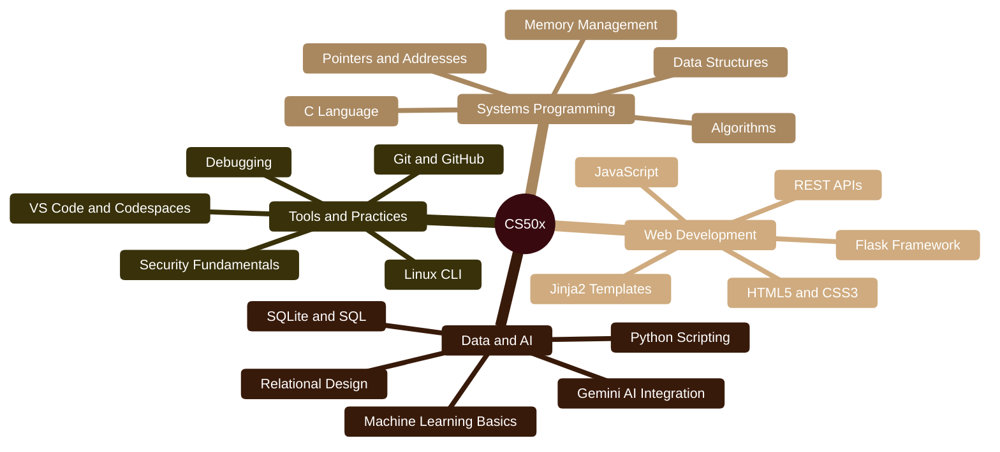

```mermaid
%%{init: {'theme': 'base', 'themeVariables': {
  'primaryColor': '#A51C30',
  'primaryTextColor': '#ffffff',
  'primaryBorderColor': '#7f1010',
  'secondaryColor': '#d6c6b3',
  'secondaryTextColor': '#2b1a12',
  'tertiaryColor': '#f2e8dc',
  'tertiaryTextColor': '#2b1a12',
  'lineColor': '#7f1010',
  'fontSize': '14px'
}}}%%
mindmap
  root((CS50x))
    Systems Programming
      C Language
      Memory Management
      Pointers and Addresses
      Data Structures
      Algorithms
    Web Development
      HTML5 and CSS3
      JavaScript
      Flask Framework
      Jinja2 Templates
      REST APIs
    Data and AI
      SQLite and SQL
      Relational Design
      Python Scripting
      Gemini AI Integration
      Machine Learning Basics
    Tools and Practices
      Git and GitHub
      Linux CLI
      VS Code and Codespaces
      Debugging
      Security Fundamentals
```