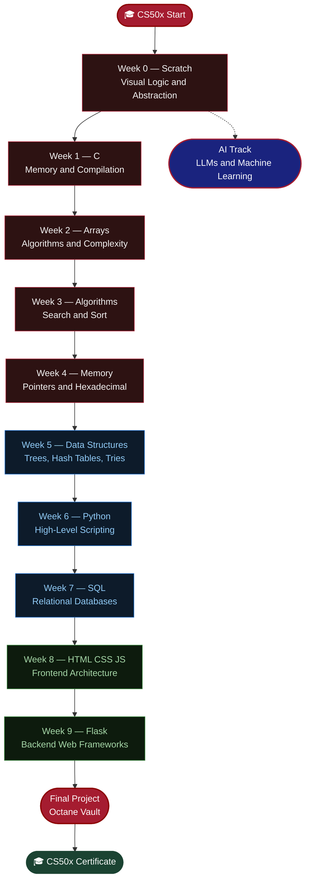
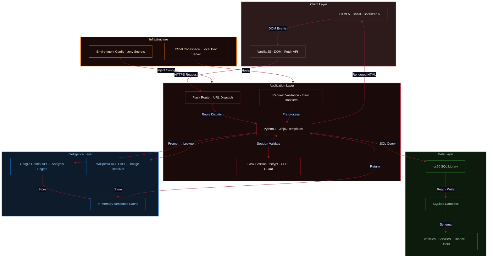
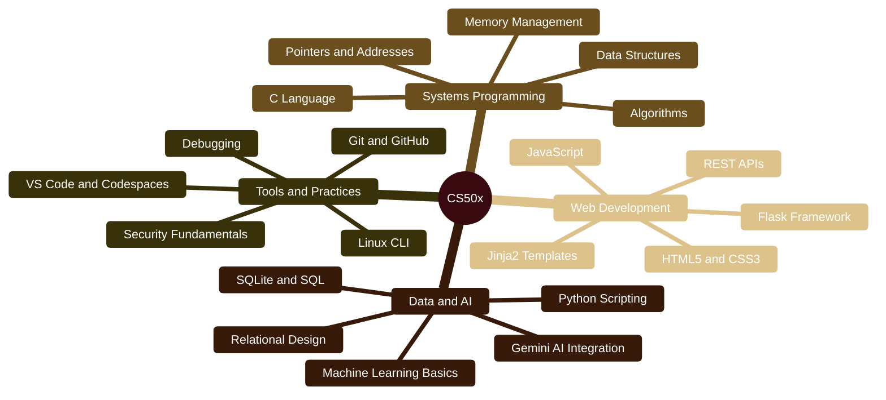

   
  
    
  
   
  <i>An introduction to the intellectual enterprises of computer science and the art of programming</i>
    

  
  
  
  

 

---

## 🧭 Navigation

    

   

---

## 🗺️ Curriculum Roadmap

---

## 📂 Weekly Breakdown

| Module | Intellectual Focus | Tech Stack | Repository |
|:------:|:-------------------|:----------:|:----------:|
| **`WEEK 00`** | Visual Logic & Abstraction |  | [🔗 Open](./Week%200%20Scratch) |
| **`WEEK 01`** | Memory & Compilation |  | [🔗 Open](./Week%201%20C) |
| **`WEEK 02`** | Data & Complexity |  | [🔗 Open](./Week%202%20Arrays) |
| **`WEEK 03`** | Search & Sort Mechanisms |  | [🔗 Open](./Week%203%20Algorithms) |
| **`WEEK 04`** | Pointers & Hexadecimal |  | [🔗 Open](./Week%204%20Memory) |
| **`WEEK 05`** | Trees, Hash Tables, Tries |  | [🔗 Open](./Week%205%20Data%20Structures) |
| **`WEEK 06`** | High-Level Scripting |  | [🔗 Open](./Week%206%20Python) |
| **`WEEK 07`** | Relational Databases |  | [🔗 Open](./Week%207%20SQL) |
| **`WEEK 08`** | Frontend Architecture |  | [🔗 Open](./Week%208%20HTML,%20CSS,%20JavaScript) |
| **`WEEK 09`** | Backend Web Frameworks |  | [🔗 Open](./Week%209%20Flask) |
| **`FINAL`** | Full-Stack Capstone |  | [🔗 Open](./Week%2010%20The%20End/Final%20Project/Octane_Vault) |
| **`AI`** | LLMs & Machine Learning |  | [🔗 Open](./Artificial%20Intelligence) |

---

## 💡 Highlighted Learning Moments

<b> Week 1–2 · C & Arrays — The Foundation</b>

 

Diving into C stripped away every abstraction. Manual memory allocation, pointer arithmetic, and segmentation faults taught discipline that no high-level language can replicate. Understanding the call stack and heap at a byte level fundamentally changed how I reason about every program I write.

<b> Week 3–5 · Algorithms & Data Structures — The Engine</b>

 

Implementing merge sort, binary search trees, hash tables, and tries from scratch demystified the "magic" inside standard libraries. The O(n log n) vs O(n²) trade-offs became viscerally real when running performance benchmarks on large datasets.

<b> Week 6–7 · Python & SQL — The Productivity Leap</b>

 

After weeks in C, Python felt like a superpower. Translating C problem sets to Python showed how language choice shapes developer velocity. SQL joins and subqueries unlocked relational data modeling — a paradigm shift from procedural thinking.

<b> Week 8–9 · Web & Flask — The Full Picture</b>

 

Building end-to-end web apps with Flask, Jinja2, and SQLite connected every prior concept. Sessions, cookies, CSRF tokens, and the request/response lifecycle revealed the complexity hidden behind every browser interaction.

---

## 🏎️ Final Project: Octane Vault

  
    
  

 

**Octane Vault** is a high-performance automotive asset management platform — a "Garage Operating System" engineered for collectors and enthusiasts. It unifies vehicle inventory, service records, financial analytics, and AI-powered data synthesis into a single, immersive web application.

### Architecture

---

##  What You Can Learn from CS50x

> *This repository is a reference for anyone who wants to self-study CS50x — one of the world's most respected free computer science courses. You don't need to pay for a certificate to gain the knowledge.*

### Skills Covered in This Course

---

## 📖 Study Guide & Resources

<b> Official CS50 Resources</b>

 

| Resource | Link |
| :--- | :--- |
| CS50x Course Page |  |
| CS50 Manual Pages |  |
| CS50 Duck Debugger |  |
| CS50 Codespace |  |
| edX Certificate |  |

<b> Recommended Supplementary Tools</b>

 

| Tool | Purpose |
| :--- | :--- |
|  | Memory leak detection in C |
|  | GNU Debugger for C programs |
|  | Visual SQLite database editor |
|  | API testing for Flask routes |
|  | Visual code execution tracer |

<b> Week-by-Week Key Takeaways</b>

 

-  Computational thinking: decomposition, pattern recognition, abstraction, algorithms
-  The C compiler pipeline: preprocessing → compiling → assembling → linking
-  Stack frames, string as `char*`, command-line arguments `argc`/`argv`
-  Big-O notation is a *ceiling*, not a guarantee
-  `malloc`/`free` symmetry; valgrind is your best friend
-  Hash collisions are inevitable; choose your hash function wisely
-  Python's `dict` is a hash table; Python lists are dynamic arrays
-  `JOIN` is set intersection; `NULL` propagates through expressions
-  The DOM is a tree; event delegation > individual listeners
-  Sessions are server-side cookies; always validate server-side

---

## 🎓 Certificate & Verification

| Parameter | Detail |
| :--- | :--- |
| **Institution** | Harvard University (via edX) |
| **Course** | CS50’s Introduction to Computer Science |
| **Track** | CS50x |
| **Status** |  |
| **Credential** |  |

 

---

## ⚖️ License & Academic Honesty

This repository is licensed under the [MIT License](./LICENSE).

> [!WARNING]
> **Academic Honesty Notice:** This repository is shared for **portfolio and reference purposes only**. All code here represents my own original work completed as part of CS50x. Per [CS50’s Academic Honesty Policy](https://cs50.harvard.edu/x/honesty), **you must not submit any of this work as your own.** *Be reasonable.*

---

##  Get in Touch 💬

---

  

 

 
*Engineered with discipline and purpose · Verified by Harvard University · CS50x — 2024*

 

